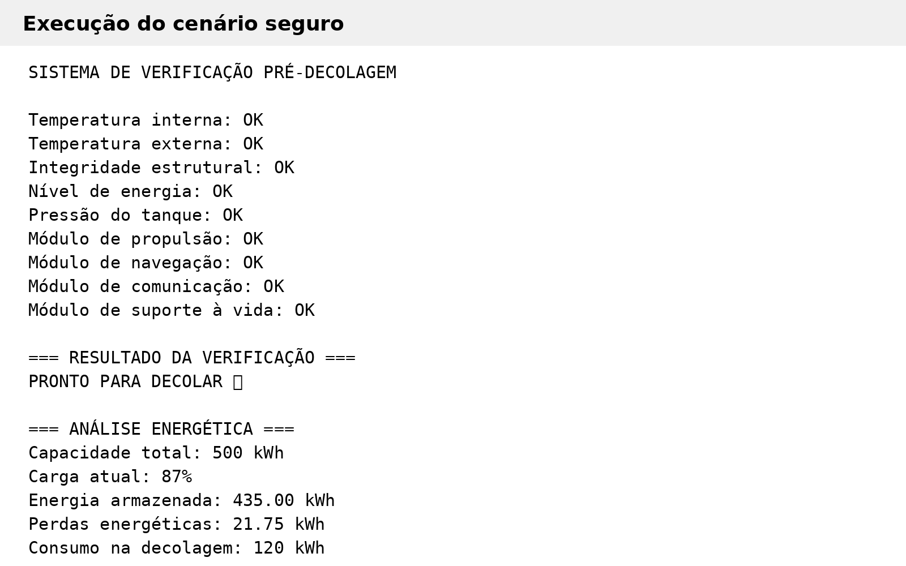
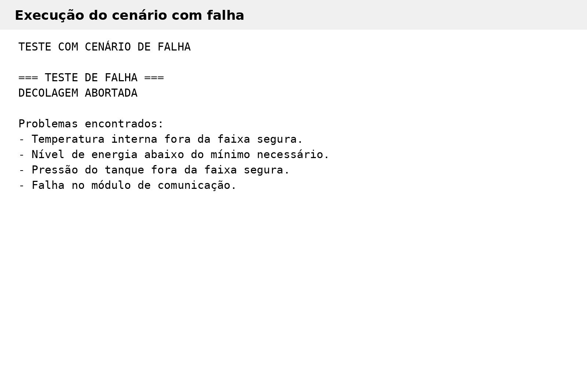

# Sistema de Verificação Pré-Decolagem 🚀

Projeto acadêmico desenvolvido em Python para simular a análise de telemetria de uma nave espacial antes da decolagem.

O sistema verifica parâmetros de segurança, identifica falhas, calcula a energia disponível e estima a autonomia após a decolagem.

> Todos os valores, limites e condições utilizados são fictícios e possuem finalidade exclusivamente acadêmica.

## Objetivos

O projeto contempla:

- organização e descrição de dados de telemetria;
- verificação automática das condições pré-decolagem;
- identificação de possíveis falhas;
- cálculo de energia disponível;
- estimativa de autonomia;
- análise assistida por inteligência artificial;
- reflexão sobre ética, impacto social e sustentabilidade tecnológica.

## Dados analisados

Os parâmetros simulados são:

- temperatura interna;
- temperatura externa;
- integridade estrutural;
- nível de energia;
- pressão do tanque;
- módulo de propulsão;
- módulo de navegação;
- módulo de comunicação;
- módulo de suporte à vida.

Os módulos e a integridade estrutural utilizam representação binária:

- `1` = funcionamento adequado;
- `0` = falha.

## Regras de segurança

| Parâmetro | Condição segura |
|---|---|
| Temperatura interna | 18 °C a 27 °C |
| Temperatura externa | -20 °C a 50 °C |
| Integridade estrutural | Deve ser 1 |
| Nível de energia | Mínimo de 70% |
| Pressão do tanque | 200 a 300 bar |
| Propulsão | Deve ser 1 |
| Navegação | Deve ser 1 |
| Comunicação | Deve ser 1 |
| Suporte à vida | Deve ser 1 |

Se todos os parâmetros estiverem dentro das condições estabelecidas, o sistema retorna:

`PRONTO PARA DECOLAR`

Caso uma ou mais verificações falhem, o resultado é:

`DECOLAGEM ABORTADA`

O programa também lista as falhas encontradas.

## Análise energética

A simulação utiliza:

- capacidade total: 500 kWh;
- carga atual: 87%;
- consumo de decolagem: 120 kWh;
- perdas energéticas: 5%;
- consumo médio de voo: 50 kWh/h.

Com esses valores, após as perdas e o consumo de decolagem, restam aproximadamente **293,25 kWh**, equivalentes a **58,65%** da capacidade total.

A autonomia estimada é de aproximadamente **5,87 horas**.

## Prints da execução

### Cenário seguro



### Cenário com falha



## Arquivos do projeto

```text
.
├── README.md
├── telemetria_espacial.ipynb
└── images
    ├── execucao_cenario_seguro.png
    └── execucao_cenario_falha.png
```

## Como executar

### Opção 1 — Google Colab

1. Faça o download do arquivo `telemetria_espacial.ipynb`.
2. Acesse o Google Colab.
3. Selecione **Arquivo > Fazer upload de notebook**.
4. Escolha o arquivo `.ipynb`.
5. Execute as células na ordem apresentada.

### Opção 2 — Jupyter Notebook

Com Python e Jupyter instalados, clone ou baixe este repositório e execute:

```bash
jupyter notebook
```

Depois, abra o arquivo:

```text
telemetria_espacial.ipynb
```

e execute as células na sequência.

## Tecnologias utilizadas

- Python 3
- Jupyter Notebook

## Observação

Este projeto foi desenvolvido como atividade acadêmica. Os parâmetros de telemetria, faixas de segurança e valores energéticos não representam especificações reais de sistemas aeroespaciais.
